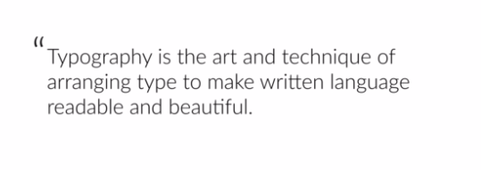

___
RESOURCE:http://codingheroes.io/resources/
___
#Web Design For Web Developers 


###<span style="color:red">25 + Guidlines For amazing Web Design </span>

####<span style="color:blue">1. Beautiful typography </span>



Good typography can make anything look good .
Lets choose Right Font.
**Rules :**

1. Use a __font size__ between **15 to 25** for body text , depending on which font face is choosen .
2. Headlines and titles bigger fonts . __*Headline 60 px*__ and __*subtitle 32 px*__ .
3. If __extreme big headline__ , __reduce font weight__ of text so that it will not look bulky.
4. __line spacing__ should be __120 % to 150 %__ of font size . To make it easy to read.
5. use __45 to 90__ characters per line 
6. Use good looking fonts like sans-serif and serif 
7. Sans-serif characteristics: 
   1. more neutral
   2. clean 
   3. simple
   4. modern websites
8. Serif :
   1. used for traditional purposes 
   2. story telling 
   3. long reading 


[GoogleFonts](https://fonts.google.com/) 

Some Web fonts :
- Serif:
  - cardo
  - marriwether
  - PT serif    
  - 


- Sans-serif:


How to choose a typeface?
1. should reflect feel of website / content
2. use serif or sans serif don't combine. Choose one typeface
3. then choose one font .
4. play around and get better.

___

###<span style="color:blue">2 . Colors</span >

>Color is most important in UI designing.

>__resources :__ 
1. [Flat Ui Colors](https://flatuicolors.com/)
2. [0 to 255 ](https://www.0to255.com/)
>__Guidlines:__

- Use only one base color like  black , white , shade of gray etc .

- Stick with one color . Don't make it messey.
- create a color pallet for selected color . 
- If want to mix 2 colors , use tools to decide.
- Use secondary color to draw attention . 

>Where to use color ?


- Use color to draw attention.
- Never use black in design.  
- Choose color wisely .

>__Colors Are associated with emotions:__

|color|emotion|Note|
|-----|---|---|
|<span style="color:red">RED |power, passion ,strenth , exitement |Brights : energetic , darks :powerful & elegant|
|<span style="color:orange">ORANGE |cheereful ,creativity, confidence, courage  |drawa attention without being overpowered like red |
|<span style="color:yellow">YELLOW|energetic , happiness, liveliness, curiosity, intelligence , braveness |
|<span style="color:green">GREEN |nature , harmony, money, life , health |can have balancing and harmonizing effect |
|<span style="color:blue">BLUE|patience, professionalism , honour , peace , trust|most loved by men, associated with  professinalism , social networks prefer it|
|<span style="color:purple">PURPLE|power, nobelity , wealth , wisdom, royalty , luxury , mistry ||
|<span style="color:Pink">PINK|romance , passivity , care , peace , affection||
|<span style="color:brown">BROWN |relaxation , confidence , worthiness , nature , comfort , reliability |


___
###<span style="color:PURPLE">3.WORKING WITH IMAGES</span >

>Makes a big difference . must be used carefully.
>Using large bg images make website attractive and increase engagement .

Guidelines for putting text on images:

1. Text can be put on image directly . 
2. >only  works when colors of text and images have enough contrast.
3. __Overlay__ The image with color or color gradient to get contrast.
   
4. Use overlay __other than black or white__ .
5. Put __text in BOX__
   
6. Use __blur__ For images either __direct blur__ or __blur the out of focus object__.
    
   
7. Text should stay on Blured part . Also in responsive design 
8. Use The Floor Fade technique: Image becomes faded at bottom and we put text in faded part . It improves readability .
   
   This is faded
    
    This is not faded .

####examples:
>To achieve the text-on-image effects I showed you before, you can use CSS for your websites. Here is example CSS code for some of the effects. Please change it according to your needs.


####__Overlay the image__

```css
.darken {
background-image: linear-gradient(rgba(0, 0, 0, 0.5), rgba(0, 0, 0, 0.5)), url(YOUR IMAGE HERE);
}
```


Example: http://jsfiddle.net/drpak8vy/1/


####Put text in a box

```css
.text-box {

background-color: rgba(0, 0, 0, 0.5);

color: #fff;

display: inline;

padding: 10px;
}
```

Example: http://jsfiddle.net/qg83m36p/


####Floor fade
```css
.floor-fade {

background: linear-gradient(to bottom, rgba(0, 0, 0, 0), rgba(0, 0, 0, 0.6) ), url(YOUR IMAGE HERE);
}
```
Example: http://jsfiddle.net/gRzPF/409/


###<span style="color:RED">4.ICONS</span>
>icons improve  asthetics . Proved better UX. Determines look and feel . If poorly used , creates user confusion.

####__Guidelines:__

- use icons to list __features /product.__
  
- icon __should be recognisable__ 
- it should __never take central role__
- it should have __supporting role__
- __user should not be confused__ seeing icons.
- Use __vector__ images __instead of raster__
  
  
###

